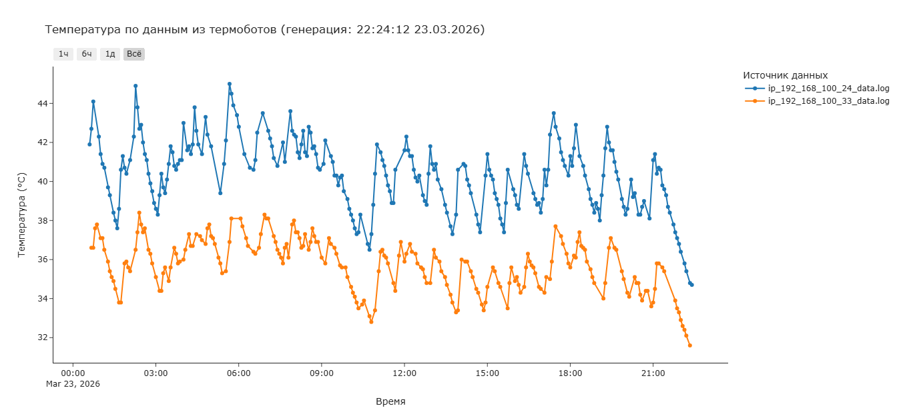

# Thermobot‑Data2Graphs

Проект посвящен сбору и визуализации данных с датчиков температуры устройств на базе ESP8266 Thermobot от [42юнита.ру](https://www.42unita.ru).

***Обратите внимание** на предположение, что описанные устройства более не будут доступны к покупке и представляют интерес только для настоящих владельцев.*

*Рисунок. Пример графика проекта thermobot_hass@esphome*

## История проекта

- **Эра до Home Assistant:** с оригинальной прошивкой производителя собирал сырые данные через web-интерфейс и строил графики (работа скриптов протестирована и эксплуатировалась для артикулов: Thermobot-2.2,  Thermobot-2 Mini). 
- **Эра c Home Assistant:** с оригинальной прошивкой производителя [собирал данные через RestAPI](thermobot_hass/README.md).
- **Эра c Home Assistant и ESPHome:** [использую собственную прошивку ESPHome и конфигурацию устройства Thermobot-2 Mini](thermobot_hass/esphome/README.MD)

## Описание (архивное)

Проект (только для пользователей домашних серверов GNU Linux и Home Assistant) позволяет:
- загружать данные с термобота (формат: CSV/JSON);
- обрабатывать временные ряды температур;
- строить графики изменения температуры во времени;
- экспортировать графики в PNG/SVG.

*Рисунок. Пример графика архивного проекта thermobot_graf*

