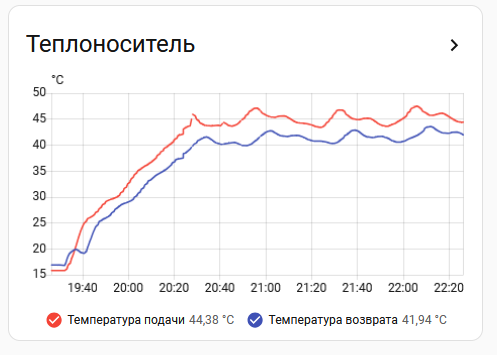
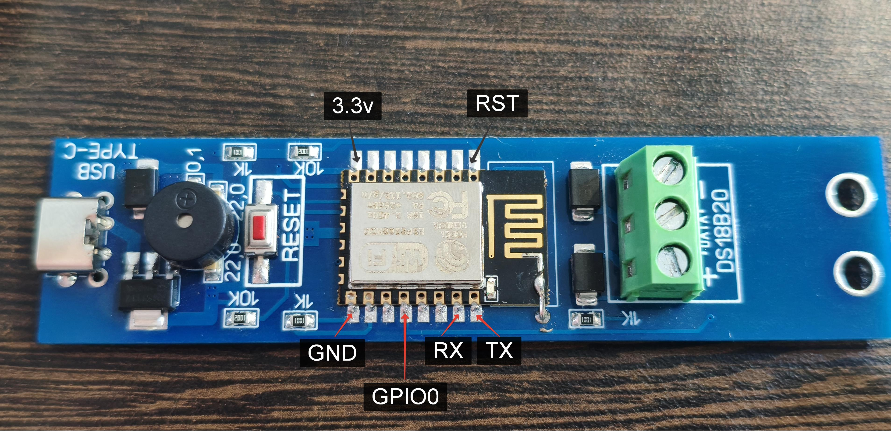
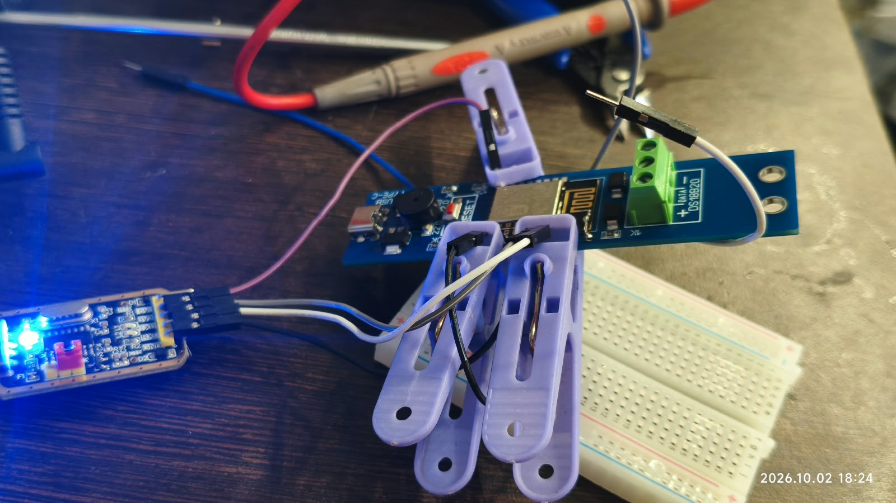

# Thermobot‑2 Mini — ESPHome‑мониторинг температуры в Home Assistant

Конфигурация для платы **Thermobot‑2 Mini** под задачи контроля температур в отопительных системах. Проект ориентирован на *почти простое* развёртывание и гибкую настройку.



*Рисунок. Пример графика проекта thermobot_hass@esphome*

## Что делает устройство

- Считывает температуру с датчиков Dallas DS18B20 через one‑wire на GPIO0.
- Показывает статус работы с помощью светодиода на GPIO2.
- Передаёт в Home Assistant температуру подачи, обратки и (опционально) третьего и других датчиков.
- Формирует аптайм (в секундах).
- Подаёт визуальный сигнал (мигание светодиода) при успешном подключении к Wi‑Fi.

## Аппаратная часть

- **Плата:** Thermobot‑2 Mini с ESP8266MOD (4Mb).
- **Производитель:** [42unita.ru](https://www.42unita.ru).
- **Датчики:** DS18B20 (one‑wire). В оригинале от производителя смонтирован один, под проект без изменения схемы подключения параллельно добавлен еще один. Адреса датчиков уникальные, актуальные можно узнать из логов устройства в ESPHome, первоначально указать в YAML 0x0000000000000000, потом заменить на актульный. 
- **Индикатор:** светодиод с инверсной логикой.
- **Прошивка:** с адаптером USB‑UART на базе CH340G.



*Рисунок: Схема пинов для прошивки Thermobot‑2 Mini.*

## Программная часть

- **Создание прошивки** ESPHome для ESP8266MOD (4Mb) осуществляется с помощью файла [heatflow.yaml](heatflow.yaml) и завершается  скомпилированным firmware.bin.
- **Прошивка проекта** локально с помощью esptool через адаптер USB‑UART.
- **Web-интерфейс** доступен в новой прошивке по адресу mDNS в локальной сети: [heatflow.local](http://heatflow.local), либо IP.
- **Home Assistant** получит новое устройство через стандартную интеграцию ESPhome.

## Прошивка (случай автора)



*Рисунок: Подключение Thermobot‑2 Mini локально через адаптер USB‑UART для первой прошивки*

Команда для прошивки ESP8266 в командной строке Windows:

```CLI
(venv) C:\esp\...\venv\Scripts>esptool --chip esp8266 --port COM4 --baud 115200 write-flash --flash-mode qio --flash-size 4MB 0x00000 firmware.bin
```


**Важные моменты:**
- usb type-c для прошивки **не используется!**, порт использовать только для питания прошитого устройства;
- плату к USB‑UART подключать по питанию 3,3В;
- для входа в режим прошивки: при подключении платы, *заземлить* GND к GPIO0, потом GND к RST, *отключить* GND от RST, потом GND от GPIO0; 
- заменить COM4 на актуальный COM‑порт вашего устройства;
- файл firmware.bin должен находиться в текущей рабочей директории esptool, либо использовать venv, либо полный путь к файлу;
- вариантов способов прошивки несколько, приведен тот, который точно работает у автора.


Вывод после успешной прошивки


```
esptool v5.3.1
Connected to ESP8266 on COM4:
Chip type:          ESP8266EX
Features:           Wi-Fi, 160MHz
Crystal frequency:  26MHz
MAC:                48:fa:2f:6d:2c:36

Stub flasher is already running. No upload is necessary.

Configuring flash size...
Flash parameters set to 0x0040.
Flash will be erased from 0x00000000 to 0x00072fff...
Wrote 467792 bytes (339484 compressed) at 0x00000000 in 30.6 seconds (122.5 kbit/s).
Hash of data verified.

Hard resetting via RTS pin...
```


## Настройка

### Секреты

В файле `secrets.yaml` укажите:
```yaml
wifi_0f: "ssid_вашей_сети_2.1GHz"
wifi_password: "пароль_вашей_сети_2.1GHz"
web_server_pass: "пароль_для_веб_интерфейса"
api_key: "api_ключ_для_home_assistant"
```

## Развитие проекта

### Обновление прошивки

Используйте интерфейсы ESPHome API или web по адресу mDNS в локальной сети: [heatflow.local](http://heatflow.local), либо IP

### Что можно еще...

Не задействован распаянный пискун. Его можно задействовать для критических температур, либо существенной разницы между показаниями датчиков (пример, при проблеме с циркуляцией теплоносителя).
